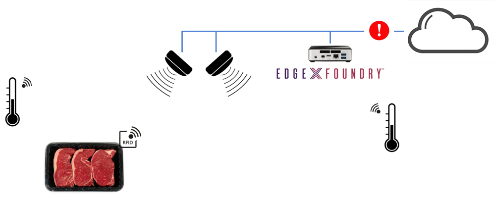

# Intel® Inventory Suite Food Safety service
[](LICENSE)

Food safety service is a sample application that demonstrates how to combine Intel® RSP sensor data with a third-party temperature sensor from EdgeX platform to determine arrival of assets to a specific location (freezer) and ambient temperature of the area.
This application also leverages EdgeX Alerts & Notification service to notify users via email.

 

## Getting Started

### Dependencies

#### Software
- `docker`
- `docker-compose`
- `Intel rsp-sw-toolkit-gw`
- `Intel inventory-suite`
- `EdgeX Edinburgh release`

Assumption is that Intel© RSP and temperature sensor are already configured and sending data to EdgeX. 

### Build Instructions
Compile the Go source code, create the docker image, and start the docker-compose service

> :warning: **_Notice_**
>
> Replace `GIT_TOKEN=...` with your access token generated from `github.impcloud.net` like so: `GIT_TOKEN=abc34f2323fcda2ad23`

```bash
sudo GIT_TOKEN=... make -j iterate
```

> The first time you run this it may take quite some time. Grab some :coffee:.

> To stop the docker services gracefully, simply press `Ctrl-C` in your terminal. Press `Ctrl-C` a second time to kill the containers.

### Configuration variables

- `freezerReaderName` Name of the Intel® RSP readers for destination.
- `emailSubscribers` String comma separated of emails to receive notifications. Example: "your@email.com,your@email2.com"
- `trackingEPCs` String comma separated of EPC tags that want to be tracked. Example: "30143639F8419145BEEF0000,30143639F8419145BEEF0001"
- `temperatureSensor` EdgeX's device name of the temperature sensor for ambient temperature value.

### Application Flow

- Subscribe to EdgeX core data via EdgeX's Apps function SDK to receive `inventory_event` and `temperature` messages.
  - When an EPC tag moves to the `freezerReaderName` an email is sent out that the item arrived its destination along with the current ambient temperature of the area.
